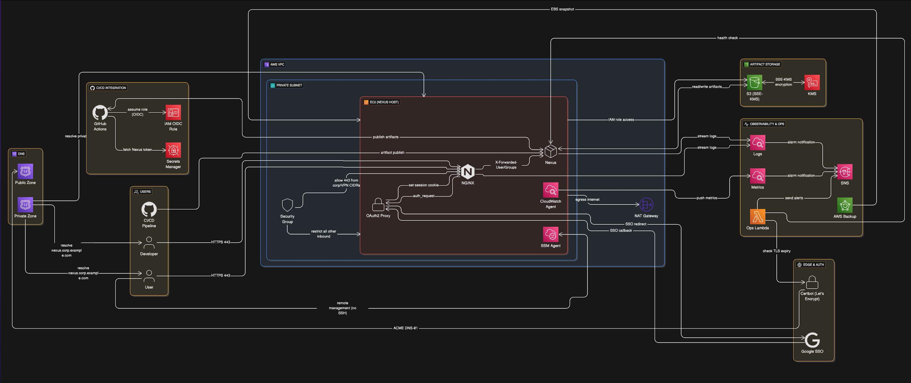

# Production‑Ready Nexus OSS on AWS (Zero‑Trust, S3/KMS, CI/CD)

A End‑to‑end deployment of **Sonatype Nexus OSS** on **AWS**, secured with **Google SSO (OAuth2 Proxy)**, fronted by **NGINX** with TLS via **Let’s Encrypt (DNS‑01 / Route53)**, and storing artifacts on **S3 with KMS encryption**.  
Infrastructure is **Terraform**, host config is **Ansible**, CI/CD is **GitHub Actions** with **OIDC** to AWS (no static keys).

---

##  Highlights

- **Zero‑trust access**: OAuth2 Proxy + NGINX `auth_request` → Nexus RUT realm (group‑based RBAC).
- **Durable storage**: S3 blob store (SSE‑KMS) with lifecycle policies.
- **Ops‑ready**: CloudWatch logs/metrics/alarms, SSL expiry & health Lambda, daily AWS Backup.
- **CI/CD**: Maven & Gradle sample apps; publish, promote, drift workflows; SBOM uploads.
- **Security**: IAM least‑privilege, SSM (no SSH), private subnets, DNS split‑horizon.
- **Docs**: ADRs, runbooks, onboarding, diagrams.

---

## Repository Structure

```text
.
├─ infra/                              # Infrastructure as Code (Terraform + Ansible)
│  ├─ terraform/                       # AWS resource provisioning with Terraform
│  │  ├─ modules/                       # Reusable Terraform modules
│  │  │  ├─ vpc                         # VPC, subnets, routing
│  │  │  ├─ ec2                         # EC2 instance for Nexus + NGINX + OAuth2 Proxy
│  │  │  ├─ nexus_sg                    # Security groups for Nexus and related services
│  │  │  ├─ route53                     # Public & private DNS zones and records
│  │  │  ├─ iam                         # IAM roles and policies for EC2, Lambda, etc.
│  │  │  ├─ kms                         # AWS KMS keys for encryption
│  │  │  ├─ s3                          # S3 bucket for Nexus blob store
│  │  │  ├─ iam_github_oidc              # GitHub Actions OIDC trust for CI/CD
│  │  │  ├─ secrets                     # AWS Secrets Manager for Nexus tokens and credentials
│  │  │  ├─ alerts_sns                  # SNS topics for alerts and notifications
│  │  │  ├─ cw_alarms                   # CloudWatch alarms for availability and performance
│  │  │  ├─ ops_checks                  # Operational readiness/lint checks
│  │  │  ├─ cw_dashboard                # CloudWatch dashboard for Nexus metrics
│  │  │  └─ aws_backup                  # AWS Backup plans for EC2 and S3
│  │  └─ envs/
│  │     └─ prod                        # Production environment definitions
│  └─ ansible/                          # Configuration management for EC2 host
│     ├─ roles/
│     │  ├─ nexus                       # Install and configure Nexus OSS
│     │  ├─ nginx                       # Reverse proxy and SSL termination
│     │  ├─ oauth2_proxy                 # OAuth2 Proxy for Google SSO
│     │  ├─ certbot                     # Let's Encrypt DNS-01 automation
│     │  └─ cloudwatch                  # CloudWatch agent and logging configuration
│     └─ playbooks/
│        └─ site.yml                    # Main Ansible playbook
├─ ci/                                  # CI/CD workflows and helper scripts
│  ├─ github-actions/
│  │  ├─ publish.yml                    # Publish Maven/Gradle artifacts to Nexus
│  │  ├─ promote.yml                    # Promote artifacts across repositories
│  │  ├─ drift.yml                      # Terraform drift detection
│  │  ├─ sbom-upload.yml                # Upload SBOM to Nexus
│  │  └─ access_review.yml              # Review and audit user access
│  └─ scripts/
│     ├─ promote_maven.sh               # CLI helper for Maven artifact promotion
│     └─ export_users.py                 # Export Nexus users for audit/review
├─ docs/                                # Documentation
│  ├─ adr/                              # Architecture Decision Records
│  │  ├─ ADR-001.md
│  │  ├─ ADR-002.md
│  │  ├─ ADR-003.md
│  │  ├─ ADR-004.md
│  │  ├─ ADR-005.md
│  │  ├─ ADR-006.md
│  │  ├─ ADR-007.md
│  │  └─ README.md                      # ADR index and summary
│  ├─ runbooks/                         # Operational playbooks
│  │  ├─ dr_restore.md                  # Disaster recovery restore procedure
│  │  ├─ cert_renewal.md                # SSL certificate renewal steps
│  │  ├─ incident_triage.md              # Incident response and troubleshooting
│  │  └─ dev_onboarding.md               # Developer onboarding to Nexus
│  └─ diagrams/                         # Architecture and flow diagrams
│     ├─ nexus-architecture.svg
│    
└─ app-samples/                         # Sample projects for testing Nexus
   ├─ maven/                            # Maven project sample
   └─ gradle/                           # Gradle project sample
```
---

## Design Decisions (ADRs)

- ADR index: `docs/adr/README.md`
- Key ADRs:
    - Terraform + Ansible separation
    - OAuth2 Proxy + RUT realm for SSO/RBAC
    - S3 + KMS for artifact storage
    - Let’s Encrypt via DNS‑01 + NGINX termination
    - GitHub Actions OIDC + Secrets Manager
    - CloudWatch monitoring + Lambda ops checks
    - AWS Backup daily snapshots

---

## Quickstart (Phases / Sprints)

> You can run phase‑by‑phase or all at once. These commands assume AWS_PROFILE is set and you’re in the repo root.

### Phase 1 — Foundations (Terraform)
```
cd infra/terraform/envs/prod
terraform init
terraform apply
# Outputs include: private_subnet_ids, s3_bucket_name, instance_profile, nexus_private_ip, etc.

```
### Phase 2 — App Deployment & Security (Ansible, via SSM + dynamic AWS inventory)

1. Fill variables: `infra/ansible/group_vars/all.yml` (domain, email, Google OAuth IDs, cookie secret, etc.)
2. Inventory plugin uses EC2 **tags** (`Environment=prod`, `Role=nexus`).
```
cd infra/ansible
ansible-galaxy collection install -r requirements.yml
pip install boto3 botocore
ansible-playbook playbooks/site.yml

```
- Result: Nexus + NGINX + OAuth2 Proxy + Certbot + CloudWatch configured.
- Private DNS record for nexus.corp.yourdomain.com added via Terraform.


### Phase 3 — CI/CD Integration (GitHub Actions)

- Terraform creates GitHub OIDC provider, roles, and Secrets Manager entries.
- Replace placeholders in `ci/github-actions/*.yml` with **TF outputs** (or set repo variables).
Workflows:
- `publish.yml` — publishes Maven/Gradle packages to Nexus
- `promote.yml` — snapshot → release promotion
- `drift.yml` — nightly Terraform plan

### Phase 4 — Observability & Ops

- Terraform creates SNS topic, CloudWatch alarms (CPU, status, NGINX 5xx), dashboard, Lambda SSL/health checks, AWS Backup.
```
cd infra/terraform/envs/prod && terraform apply
# Confirm SNS email subscription

```

### Phase 5 — Quick Polish

- GPG signing for releases (GPG key + passphrase in Secrets Manager).
- SBOM raw repo + CI SBOM uploads.
- Monthly access‑review export to S3.
- `/welcome` page behind SSO.
- Dev onboarding doc.

---

## Security Posture

- **No SSH**: SSM Session Manager only.
- **Private subnets**; NAT for egress; SG restricts 443 to corp/VPN CIDRs.
- **KMS encryption** (S3, Secrets Manager).
- **OIDC to AWS** for CI; no long‑lived AWS keys.
- **Role‑based access** in Nexus via SSO group claims.

---

## Sample Apps & Publishing

- `app-samples/maven` — simple lib + CycloneDX; mvn `-B deploy publishes`:
    - `*-SNAPSHOT` → `maven-snapshot`
    - Release versions → `maven-release`
- `app-samples/gradle` — `Gradle publish` using `~/.gradle/gradle.properties`
- SBOMs: CI job uploads to `repository/sboms/<project>/<timestamp>/bom.(json|xml)`.

---

## Operations

- Dashboards: CloudWatch `“nexus‑overview”`.
- Alerts: SNS email (CPU, status checks, 5xx spikes, SSL ≤14d, health fail).
- Backups: AWS Backup daily snapshot via tag selection (`Role=nexus`).
- Runbooks:
    - DR restore: `docs/runbooks/dr-restore.md`
    - Cert renewal: `docs/runbooks/cert-renewal.md`
    - Incident triage: `docs/runbooks/incident-triage.md`
    - Dev onboarding: `docs/runbooks/dev-onboarding.md`

---

## Tech Stack

- **Cloud:** AWS (VPC, EC2, S3, Route53, KMS, CloudWatch, Lambda, Backup, SNS)
- **Infra:** Terraform modules (env‑scoped in `envs/prod`)
- **Config:** Ansible + SSM (dynamic inventory)
- **Edge:** NGINX + OAuth2 Proxy (Google)
- **Registry:** Sonatype Nexus OSS
- **CI/CD:** GitHub Actions + OIDC + Secrets Manager

---

## Definition of Done

- All phases applied without manual console steps (except SNS email confirm).
- TLS valid; SSO enforced; RUT headers mapped; repo creation & S3/KMS working.
- CI publish/promotion passing; SBOM uploads present.
- Alarms green; dashboard populated; backups running; runbooks in place.

---

## Useful Links

- ADR index → `docs/adr/README.md`
- Developer onboarding → `docs/runbooks/dev-onboarding.md`

---


